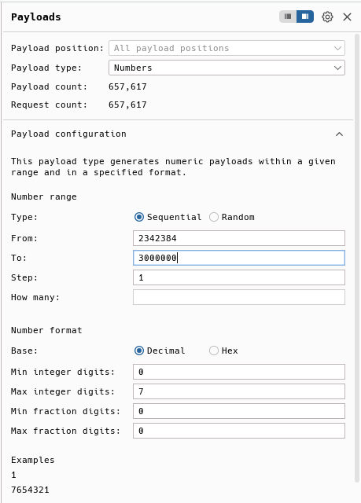
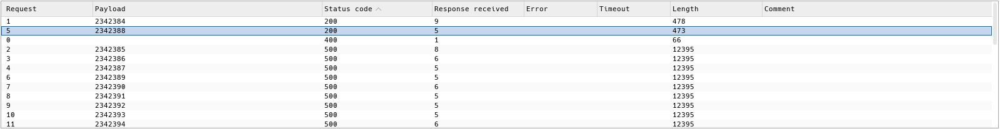
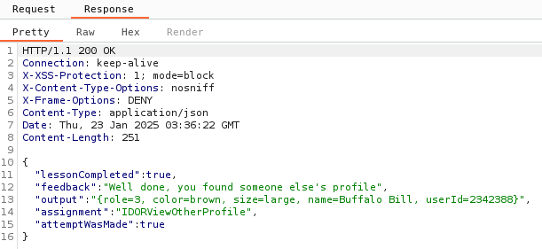

## Challenge name: Playing with the Patterns

**Challenge Description:**
View Another Profile
View someone else’s profile by using the alternate path you already used to view your own profile. Use the 'View Profile' button and intercept/modify the request to view another profile. Alternatively, you may also just be able to use a manual GET request with your browser.

**My Solution**
- This challenge is done by brute force `userId` from `/WebGoat/IDOR/profile/{userId}`, as entering it manually would be very time consuming.
- Send the packet into Burp Suite's Intruder with the following payload and click Start attack:

- Sort Status code ascending so you can easily see the 200 status codes and see that there is a `userId` with value `2342388` that returns status code 200.

- Go to the response of this packet to see the result of completing this challenge.

[Next challenge](chall-3-2.md)
[Back to list](/README.md)