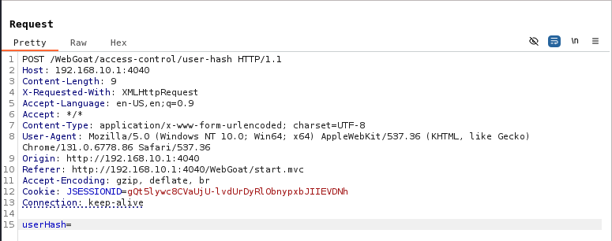
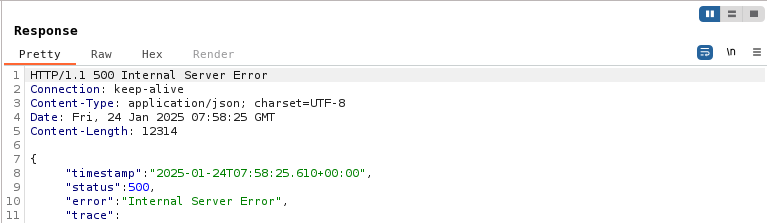
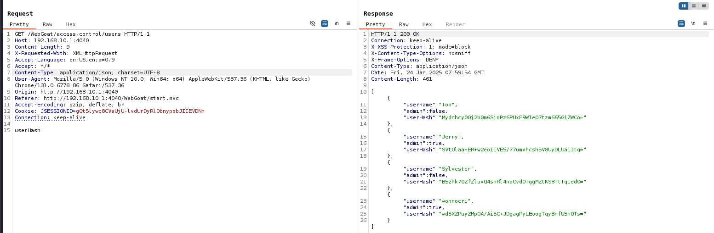

## Challenge name: Gathering User Info

**Challenge Description:**
Often data dumps originate from vulnerabilities such as SQL injection, but they can also come from poor or lacking access control.

It will likely take multiple steps and multiple attempts to get this one:

Pay attention to the comments and leaked info.

You’ll need to do some guessing too.

You may need to use another browser/account along the way.

Start with the information you already gathered (hidden menu items) to see if you can pull the list of users and then provide the 'hash' for Jerry’s account.

**My Solution**
- After clicking submit hash, we have a packet with a header as shown below, there is an end point `/WebGoat/access-control/user-hash`, but we need to find Jerry's hash and the current goal is to find the end point containing Jerry's hash.

- In the hidden item of challenge 1 there is the following link:

- It's safe to assume that the full endpoint to look for is `/WebGoat/access-control/users`, convert it to a GET method, and send the packet.

- Error with status code 500, because it requires `Content-Type` as `application/json`, so change the `Content-Type` of the packet to send to `application/json` and send back will see the hash list and in it contains Jerry's hash, enter and submit this hash to complete the challenge.
