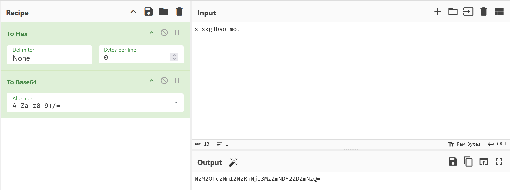
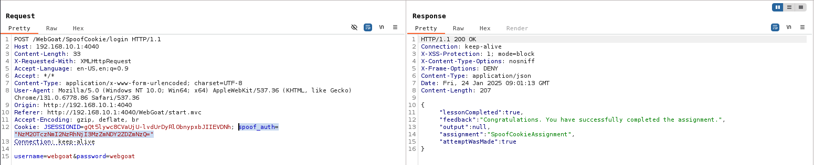

## Challenge name: Notes about the login system

**Challenge Description:**
When an authentication cookie is sent, the system will log in the user directly if the cookie is valid.

When a cookie is not sent, but credentials provided are correct, the system will create an authentication cookie.

The login will be denied on any other cases.

Pay attention to the feedback message that you will get during the attacks.

When you understand how the authentication cookie is generated, try to spoof the cookie and login as Tom.

**My Solution**
- This challenge is given 2 accounts webgoat and admin, use it to login and compare 2 cookies of 2 accounts.
- Received 2 `spoof_auth` including `webgoat` account's `NzM2OTczNmI2NzRhNjI3MzZmNDY3NDYxNmY2NzYyNjU3Nw==` and `admin`'s `NzM2OTczNmI2NzRhNjI3MzZmNDY2ZTY5NmQ2NDYx`
- Decoding got a hex string and continuing to decode the hex, I was sure I had guessed the cookie. After decoding both, I got 2 strings `siskgJbsoFtaogbew` and `siskgJbsoFnimda`
- This string consists of random characters at the beginning and the last characters are the reverse of the username. This way we can manually create a `spoof_auth` for tom.
- First reverse the string `tom` to `mot` and put at the end of the random characters like `siskgJbsoF`, then just convert them to hex and finally to base64.

- Use this `spoof_auth` to log in and the challenge will be completed.
