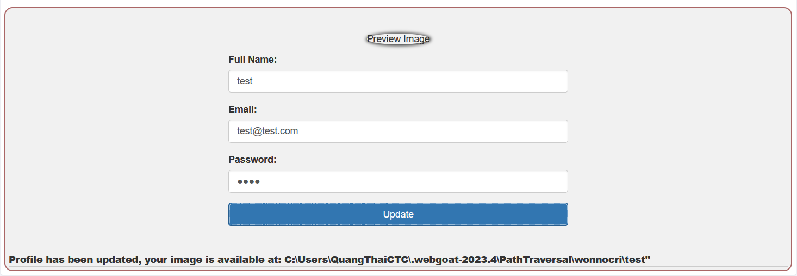
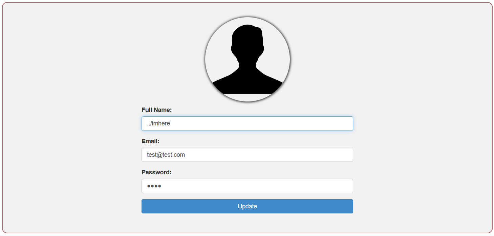
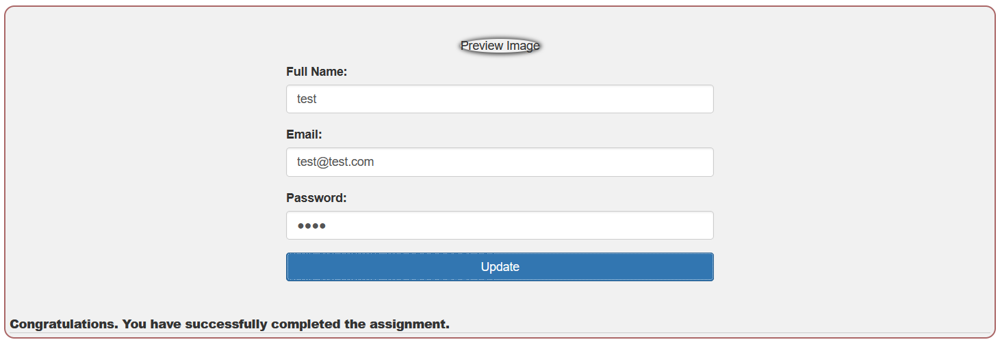

## Challenge name: Path traversal while uploading files

**Challenge Description:**
In this assignment, the goal is to overwrite a specific file on the file system. Of course, WebGoat cares about the users so you need to upload your file to the following location outside the usual upload location.

**My Solution**
- When trying to upload a photo, the server will return a link like below:

- The path shows us that the server used `Full name` as the name for the file we just uploaded.
- Our goal is to find a way to bypass and upload files in another directory.
- Currently, every time we upload a file, these files will be located in the wonnocri folder (my username).
- I will upload my file to the parent directory of the current directory using `../` and with the name `imhere`. The full version would be `../imhere`

Upload successfully and complete the challenge.
