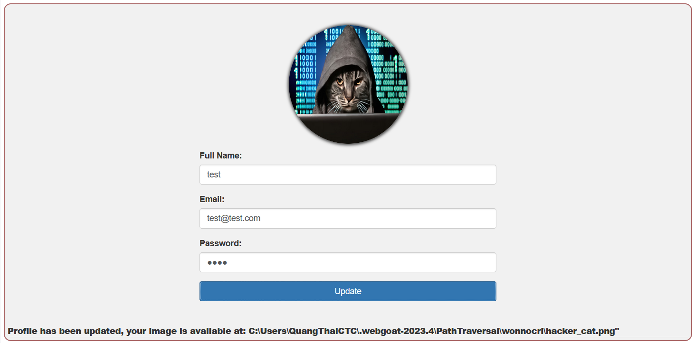
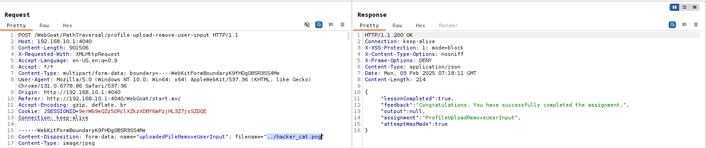

## Challenge name: Path traversal while uploading files

### Challenge Description:
The developer again became aware of the vulnerability by not validating the input of the full name input field. A fix was applied in an attempt to solve this vulnerability.

Again the same assignment, but can you bypass the implemented fix?

### My Solution
- In this challenge, they did not use `Full name` as the image name anymore, but they used the original name of the image to avoid inserting strange characters.

- So what to do now? It's simple, Burp Suite tool will help us with that.
- Capture the packet when we start uploading the file, then change the `filename` location below as we did and complete the challenge.
