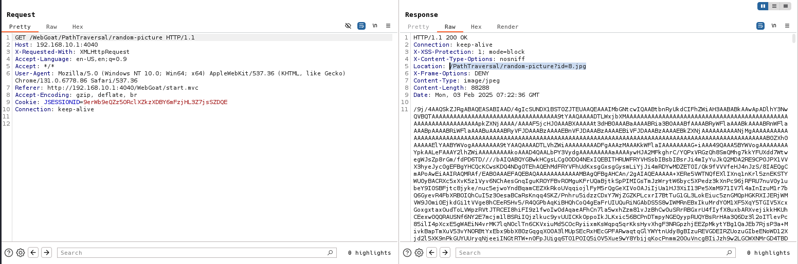
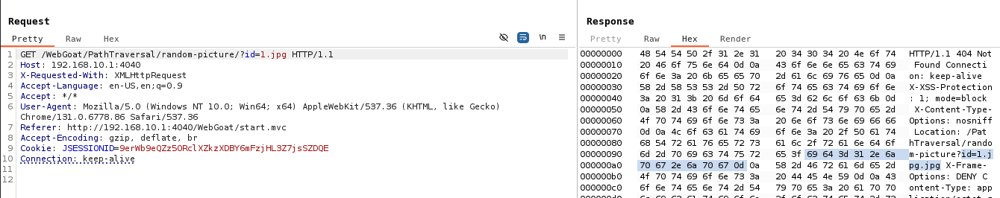
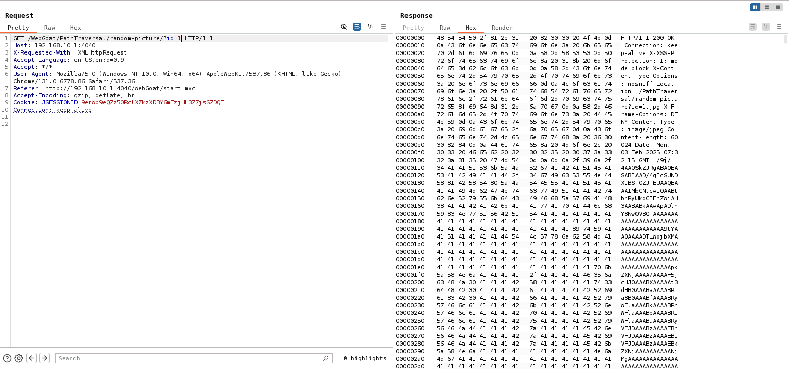
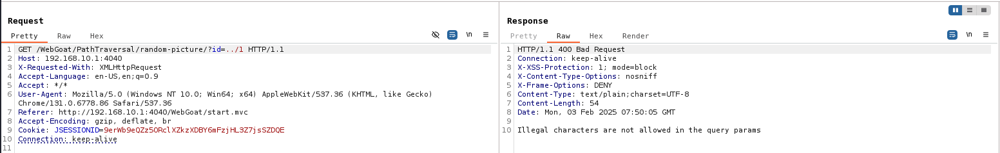
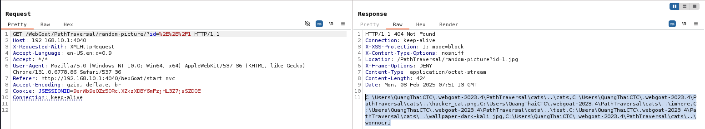
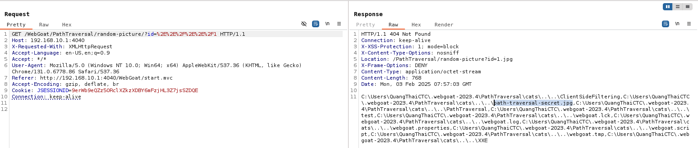
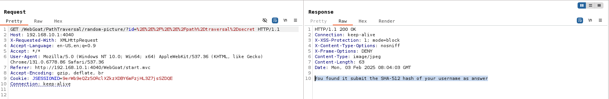

## Challenge name: Retrieving other files with a path traversal

**Challenge Description:**
Path traversals are not limited to file uploads; when retrieving files, it can be the case that a path traversal is possible to retrieve other files from the system. In this assignment, try to find a file called path-traversal-secret.jpg

**My Solution**
- Every time you select `Show random cat picture` you will see a returned packet like below.

- The `id` parameter will be the name of the image we need to query.
- I tried passing in the `id` parameter with the value `1.jpg` and got the response `Not Found` and there was a part that caught my attention `id=1.jpg.jpg`.

- This means that the server will automatically add the `jpg` extension to the `id` parameter.
- I tried removing `.jpg` for the `id` parameter and it actually worked.

- Next, the goal will be to find an image named `path-traversal-secret.jpg`, the bypass is similar to challenge 3.

- This error says that the characters I passed in the parameter are invalid.
- Có lẽ chúng ta sẽ dùng cách `URL Encode` giá trị truyền vào tham số, như thế này `%2E%2E%2F1`. These values ​​mean: `%2E` is `.` and `%2F` is `/`.

- The result returned `Not Found`, but it is not useless, although the result returned is `Not Found` but it included files in the parent directory of the current directory, which means the method we just did worked.
- Try going out one more directory by passing in the string `%2E%2E%2F%2E%2E%2F1`, which means adding another `../`.

- As the response shows, we are sure where the image `path-traversal-secret.jpg` is. Just change the value `1` of the `id` parameter from earlier to `path%2Dtraversal%2Dsecret` and the full result will be `%2E%2E%2F%2E%2E%2Fpath%2Dtraversal%2Dsecret` with `%2D` being `-`.

- We get the result `You found it submit the SHA-512 hash of your username as answer`
- Follow - submit results and complete the challenge.