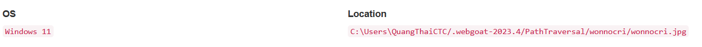
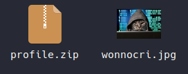
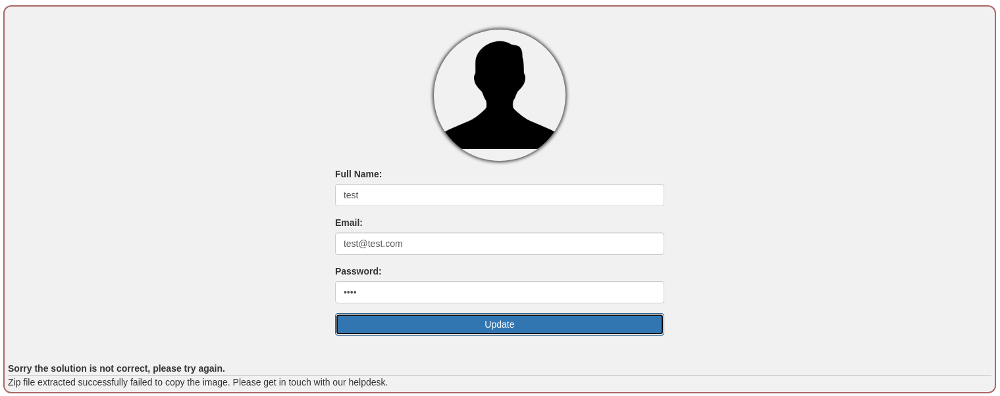
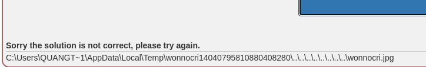
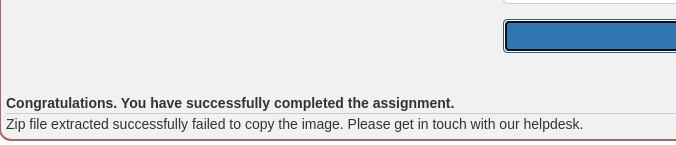

## Challenge name: Zip Slip assignment

### Challenge Description:
This time the developers only allow you to upload zip files. However, they made a programming mistake in uploading the zip file will extract it, but it will not replace your image. Can you find a way to overwrite your current image bypassing the programming mistake?



### My Solution
- Try creating a zip file containing an image like below and update your profile to see if anything happens.

- The message shows that the zip file was successfully extracted but failed to copy the image. I don't understand what that means, but I'm guessing that my zip file might have been extracted as an image and it's located outside of the desired dev directory.

- I use the command to create a zip file with the following syntax `zip -r profile.zip ../../../../../../../../../wonnocri.jpg` in the hope of finding some more clues by going to the outermost directory of the server.
> **Note:** The `profile.zip` file above is also created with this syntax but has only one `../` string.
- There was actually a clue, when I uploaded the zip file I just created, when the path error occurred and it couldn't be unzipped, the server would return the path containing the temporary file and inside was the zip file I just uploaded.

- Now, we have clearly collected all the clues, just need to exploit and upload the image to the folder as given to complete the challenge.
- From the article's hints and collected clues, I have reconstructed a part of the directory tree for easy visualization.
```
C
└── Users
    └── QuangThaiCTC
        ├── AppData
        │   └── Local
        │       └── Temp
        │           └── wonnocri
        │               └── profile.zip
        └── .webgoat-2023.4
            └── PathTraversal
                └── wonnocri
                    └── wonnocri.jpg
```
- In which `C:\Users\QuangThaiCTC/.webgoat-2023.4/PathTraversal/wonnocri/wonnocri.jpg` is where the image we need to upload is stored and `C/Users/QuangThaiCTC/AppData/Local/Temp/wonnocri/` is the folder to visualize how we will go out.
- All you need to do now is go to the folder `C/Users/QuangThaiCTC/AppData/Local/Temp/wonnocri/` and use the following command `zip profile.zip ../../../../.webgoat-2023.4/PathTraversal/wonnocri/wonnocri.jpg`.
- Finally, upload the profile.zip file you just created and complete the challenge.
