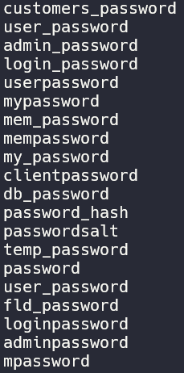

# Challenge name: Lesson 5

### Challenge desciption:

We now explained the basic steps involved in an SQL injection. In this assignment you will need to combine all the things we explained in the SQL lessons.

Goal: Can you log in as Tom?

Have fun!

### My solution
- When I use this payload: `tom' or 1=1 -- `

- Server return this error: `User {0} already exists please try to register with a different username.`
- From `lesson 4` I write this payload `tom' and substring(password,1,1)='a`
- I tried replace password from this list before

- But all error except `password`, it mean password is name of column password.

- Server return this error: `User tom' and substring(password,1,1)='a created, please proceed to the login page.`, mean this payload return `FALSE` and first character of tom's password isn't `a`. 
- I was tried to `t` then server return this: `User {0} already exists please try to register with a different username.`
`tom' and substring(password,1,1)='t`, first character of tom's password is `t`.
- Replace index and word, we will found tom's password.

- Tom's password is `thisisasecretfortomonly`, use login page and login as Tom.
- You can use my [python script](/webgoat/a3-injection/sqli-advanced/chall-attached/exploit.py)
`Usage: python exploit.py <JSSESSIONID> <TARGET> <PORT>`
- Example: 
