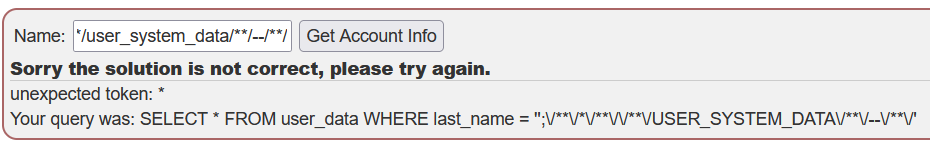

# Challenge name: Input validation alone is not enough!!

### Challenge Description:
So the last attempt to validate if the query did not contain any spaces failed, the development team went further into the direction of only performing input validation, can you find out where it went wrong this time?

### My solution
Try to use payloads in [sqli-mitigation](/webgoat/a3-injection/sqli-mitigation/chall-3.md)

Look at error, my payload has removed `SELECT` and `FROM`
Can I bypass it?
I'm insert 1 time `SELECT` and `FROM` to between it, look like:
`';selselectect/**/*/**/frfromom/**/user_system_data/**/--/**/`
While server remove `SELECT` and `FROM` then we have success query.