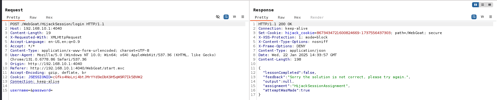
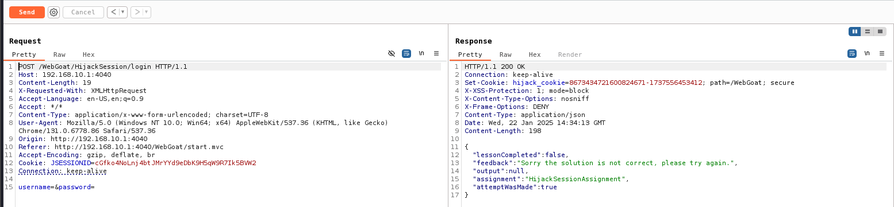
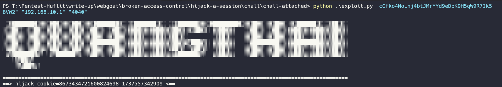
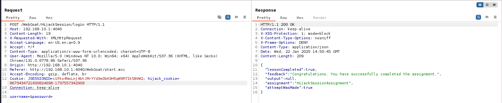

## Challenge name: Hijack a session

**Challenge Description:**
In this lesson we are trying to predict the 'hijack_cookie' value. The 'hijack_cookie' is used to differentiate authenticated and anonymous users of WebGoat.

**My Solution**
- I will use brute force method to find the answer, because I realized that sometimes in between two requests to Server there will be a session in between them.
- How? Look at the response.

- The two responses above show us that the first part of hijack_cookie has been increased by 2 units instead of 1. And the second part of hijack_cookie is the milliseconds at the time of sending the request. [You can see it here!](https://currentmillis.com/)
- I will write a python script to automatically find that mysterious session. [Here!](chall-attached/exploit.py)
- Get that python file and run it with the syntax 
  `python exploit.py <sessionId> <TARGET> <PORT>`

- For example:

- You just need to copy this hijack_cookie and paste it into the Cookie on the request as shown below and then send it, which means you have completed this challenge.

[Back to list](/README.md)