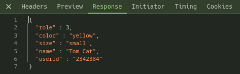
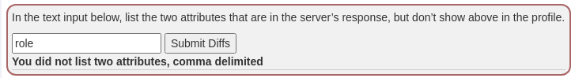

## Challenge name: Observing Differences & Behaviors

**Challenge Description:**
A consistent principle from the offensive side of AppSec is to view differences from the raw response to what is visible. In other words (as you may have already noted in the client-side filtering lesson), there is often data in the raw response that doesn’t show up on the screen/page. View the profile below and take note of the differences.

**My Solution**
- I found the answer in dev tools in the network tab there will be a packet named `profile` when clicking `View Profile`.
- Select that packet and go to the Response tab.

- It is easy to see that here the response has added 2 fields `role` and `userID`.
- If you intend to submit each field as shown below, it will notify you that you only need comma delimited.

- So just type `role,userId` into the box and press enter and this challenge is complete.

[Next challenge](chall-2.md)
[Back to list](/README.md)