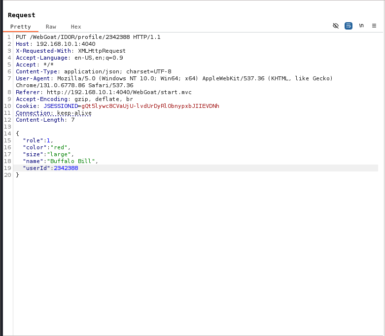
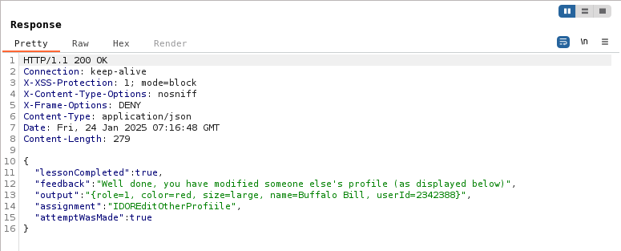

## Challenge name: Playing with the Patterns

**Challenge Description:**
Edit Another Profile
Older apps may follow different patterns, but RESTful apps (which is what’s going on here) often just change methods (and include a body or not) to perform different functions.

Use that knowledge to take the same base request, change its method, path and body (payload) to modify another user’s (Buffalo Bill’s) profile. Change the role to something lower (since higher privilege roles and users are usually lower numbers). Also change the user’s color to 'red'.

**My Solution**
- To solve this challenge, we will use HTTP PUT to be able to change Buffalo Bill's data, change the method to PUT and Content-Tpye to application/json and the body is the data in json format that needs to be modified as required.

- After sending the packet, you will receive a response to complete the challenge.
