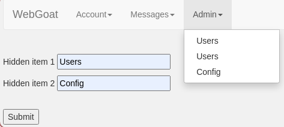

## Challenge name: Finding hidden items

**Challenge Description:**
There are usually hints to finding functionality the UI does not openly expose in:

HTML or javascript comments

Commented out elements

Items hidden via CSS controls/classes

Your mission
Find two invisible menu items in the menu below that are or would be of interest to an attacker/malicious user and submit the labels for those menu items (there are no links right now in the menus).

**My Solution**
- Go to dev tools in `Source` and you will see a very suspicious file named `ac.css` with the content:
```
.hidden-menu-item {
    display:none;
    visibility:hidden;
}
```
- If we change the value of `visibility` to visible, a drop down named Admin will appear in the navbar with 2 hidden items to find named `Users` and `Config`. Enter and complete the challenge.
