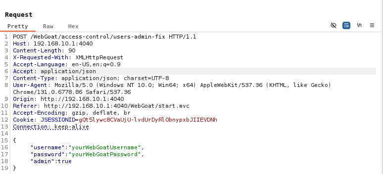
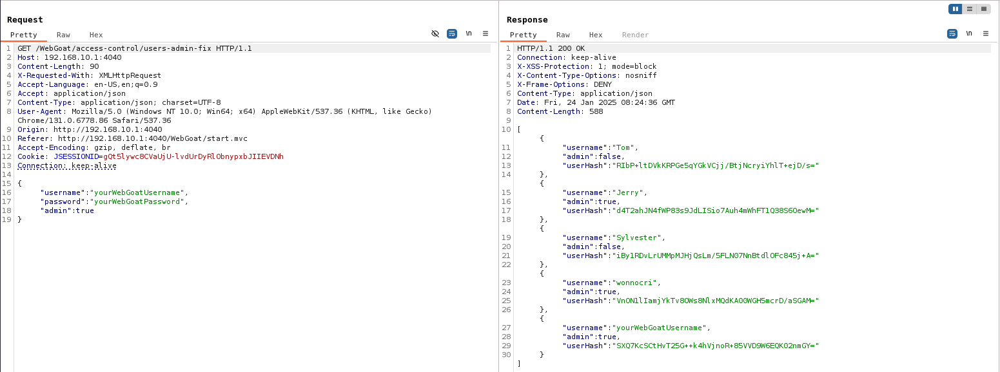

## Challenge name: The company fixed the problem, right?

**Challenge Description:**
The company found out the endpoint was a bit too open, they made an emergency fixed and not only admin users can list all users.

Start with the information you already gathered (hidden menu items) to see if you can pull the list of users and then provide the 'hash' for Jerry’s account.

**My Solution**
- Similar to challenge 2, but this time use the end point of the hidden item `Users` below `Users` from earlier. Change the method to POST and change the value of `Accept` to `application/json` and Content-Type to `application/json`. The body consists of a json with 3 values ​​as shown below.

> **Explanation**: In this challenge, the only person who can see the hash list after fixing is the admin, the server will map your currently logged in WebGoat account with the hash list, if the admin returns true then you can see the fixed hash list. Therefore, here you need to create a user with the same username as the currently logged in WebGoat username.
- Once created, just change it back to GET method and get Jerry's hash to complete the challenge.
